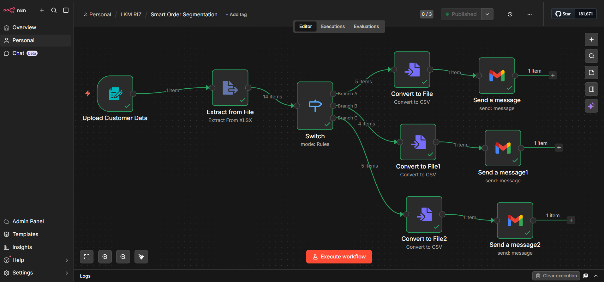

# Smart-Order-Segmentation

This workflow is an automated data ingestion, transformation, segmentation, and distribution pipeline. It processes uploaded Excel data, categorizes records based on business rules, and distributes the results as structured reports via email.

It begins with an Upload Customer Data node, where a .xlsx file is submitted through a form interface. This enables users to input order data dynamically without interacting directly with the workflow backend.
Once the file is uploaded, the Extract from File node reads the Excel file and converts it into JSON format. This transformation is critical because JSON enables structured, programmatic manipulation of the dataset within the workflow.

Next, the Switch (Rules Mode) node performs conditional segmentation based on order amount:

Branch A: Orders ≤ 2000
Branch B: Orders ≤ 3000
Branch C: Orders > 3000

This step acts as the core business logic layer, dynamically routing each record into the appropriate category.

Each branch then passes its filtered dataset into a Convert to File (CSV) node. Here, the segmented JSON data is transformed into separate CSV files, making the output easy to share, analyze, or integrate with other systems.

### Purpose of Workflow

1. Automate the ingestion and processing of Excel-based order data.
2. Categorize orders based on predefined financial thresholds.
3. Generate structured CSV reports for each category.
4. Distribute segmented insights automatically via email.

### Why This Is Powerful

1. Eliminates manual data sorting and classification.
2. Ensures consistent and error-free segmentation using rule-based logic.
3. Enables scalable handling of large datasets without additional effort.
3. Automates reporting and communication, improving operational efficiency.

### Use Cases

1. Sales Analysis: Segment customers based on purchase value for targeted strategies.
2. Financial Reporting: Quickly generate categorized revenue reports.
3. Customer Prioritization: Identify high-value vs low-value orders for business decisions.
4. Operational Automation: Replace manual Excel processing and email distribution tasks.

#### Additional Insights

**Modular architecture**: Each node handles a single responsibility (upload → transform → segment → export → send).